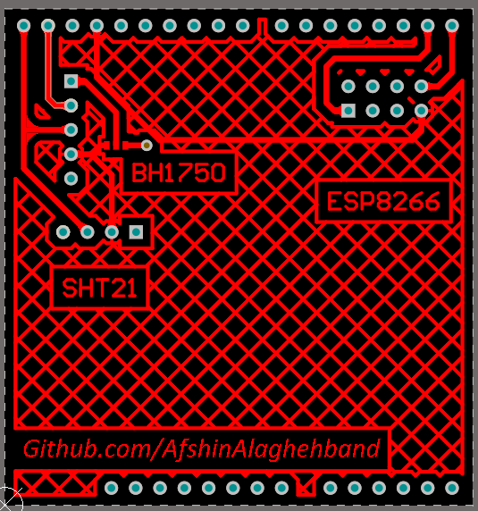
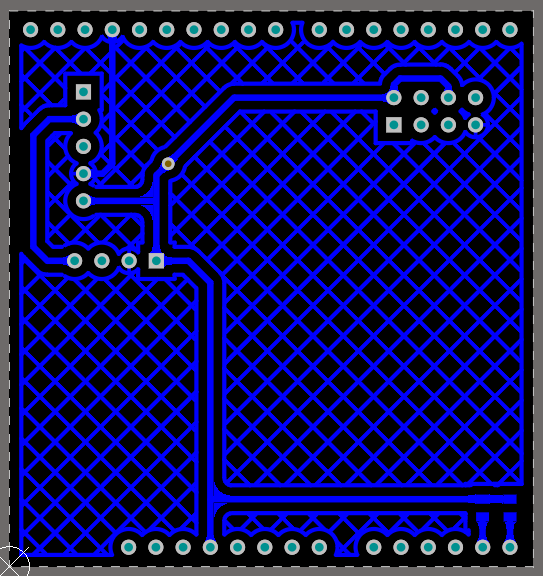

# Arduino Shield 
This shield is designed to connect ESP822, SHT21, and BH1750 modules to Arduino Uno 
its use to send area temperature and light on networks such as TCP and UDP protocol. 

## Top Layer

## Bottom Layer

## Repository Existing parts
- Altium PCB project: Schematic, PCB 
- Altium Library contains all components  
- PDF contains Schematic, PCB, and bill of materials 
- Arduino TCP sample code (.ino file)

# Bill of Materials 

|Comment|Description|Footprint|
|---|---|-|
3.3K|Resistor|2
BH1750|BH1750 Ambient Light Sensor|1
ESP8266|ESP8266-01|1
Header 6|Header, 6-Pin|1
Header 8|Header, 8-Pin|2
Header 10|Header, 10-Pin|1
JumperSMD 3Pin| |1
SHT21|SHT21 temperature and humidity sensor|1

## Contributing
Pull requests are welcome. For major changes, please open an issue first to discuss what you would like to change.

## Sorce
[Afshin Alaghehband](https://github.com/AfshinAlaghehband/PCB-Designe)

