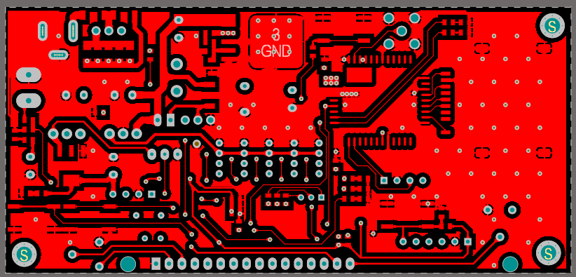
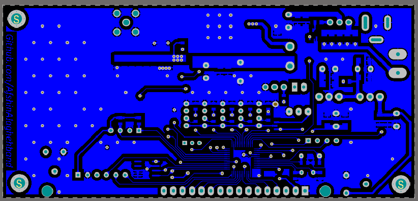
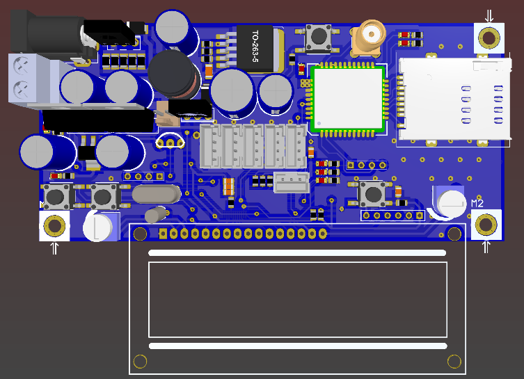

# Burglar Alarms

This board is designed to make burglar alarms. This board is powered by sim800C which is a GSM module. The board can recognize motion by a PIR module and send SMS or make calls to the saved phone numbers. Whit a Lead Acid battery, the board can work even if electricity is gone. The battery goes on the circuit automatically when the power on input is dropped and it can charge when the electricity comes back. 

## Top Layer

## Bottom Layer

## 3D View

## Board Existing parts

- STM32F051C8T6 microcontroller
- Mini ST-Link socket, programming socket (you can find it [HERE](https://github.com/AfshinAlaghehband/PCB-Designe/tree/main/ST-Link%20Mini))
- 3 LEDs and 2 switches (tech GPIO)
- Char LCD (2*16 or 4*20)
- LM35 temperature sensor (if need to check the temperature)
- USART socket
- AT24C08 EEPROM (save phones number)
- SIM800c (GSM cellolar Network) 
- sim card holder
- 12V Lead Acid battery connector + charger
- 9V PIR module sucket 

## Repository Existing parts
- Altium PCB project: Schematic, PCB 
- Altium Library contains all components  
- PDF contains Schematic, PCB, and bill of materials 
- STM32 Cube project (.ioc file)

# Bill of Materials 

|Comment|Description|Footprint|
|---|---|-|
BD140|PNP BJT|BD140
BD139|BJT|BD139
10 uF|Bipolar Capacitor|SMD_CAP_1206
100nF|Bipolar Capacitor|SMD_CAP_1206
10uF|Bipolar Capacitor|SMD_CAP_1206
20PF|Bipolar Capacitor|SMD_CAP_0805
470uF|Polar Capacitor|cap 03
1000uF|Polar Capacitor|cap 04
100 nF|Bipolar Capacitor|SMD_CAP_1206
330 nF|Bipolar Capacitor|SMD_CAP_1206
470 nF|Bipolar Capacitor|SMD_CAP_1206
1 uF|Bipolar Capacitor|SMD_CAP_1206
4.7 uF|Bipolar Capacitor|SMD_CAP_1206
22 uF|Bipolar Capacitor|SMD_CAP_1206
47 uF|Bipolar Capacitor|SMD_CAP_1206
10pf|Bipolar Capacitor|SMD_CAP_0805
100nf|Bipolar Capacitor|SMD_CAP_0805
2.2 uF|Bipolar Capacitor|SMD_CAP_0805
100 nF|Bipolar Capacitor|SMD_CAP_0805
10 uF|Bipolar Capacitor|SMD_CAP_0805
1N4007|SMD Diode, SMD Diodes|DO-214AC ( SMD Diode )
SS34|Fast or shotky Diode|DIOMELF3615N
2A|Resistor|SMD_RES_1206
Power Jack|15V DC 1A Adaptor|Power Jack
ANT|SMA Straight Jack, Up to 18 GHz|ROS-32K101-400L5_V
JumperSMD 3Pin||JumperSMD 3Pin - UltraSmall
100uh|Inductor|General 10x12(200m) Inductor
LCD-CH|LCD 16*2|LCD2-16
LED||LED0805
SIM800C|Sim800c GSM modem|Sim800c
Screw|Board Screw With Spacer|Board Screw
Battery|12V Lead acid battery|Terminal Block 2pin
Connector|PIR connector|PH 4A Connector
Connector|12V Alarm connector|Polarized Header 2
Touch Electrodes|3 pin PH connector|PH Connector 3Pin
ProgrammerSocket|programming socket|HDR1X6
BC817|NPN Bipolar Transistor|SOT23_BEC_N
3.3k|Resistor|RES 0805 (2012X06L)
4.7k|Resistor|RES 0805 (2012X06L)
330|Resistor|RES 0805 (2012X06L)
2.2K|Resistor|RES 0805 (2012X06L)
1K|Resistor|RES 0805 (2012X06L)
220|Resistor|RES 1206 (3216X08L)
68K|Resistor|RES 0805 (2012X06L)
20K|Resistor|RES 0805 (2012X06L)
10k|Resistor|RES 0805 (2012X06L)
5.6k|Resistor|RES 0805 (2012X06L)
150|Resistor|RES 0805 (2012X06L)
L7809|7809 deep 9V Linear Regulator|To-220
L7805|7805 deep 5V Linear Regulator|To-220
SimCard_Holder|Sim Holder|Standard_Sim
Switch PB|Push Button Switch|SW-PB
R2T-MiniSerial|USART connector|SerialWireMini
LM2576HVS-ADJ|Switching Voltage Regulator, SMD, LM2576HVS-Adjustable|TO-263-5
LM1117IMP-3.3|3.3 Volt, 800mA Linear Regulator|MP04A_N
AT24C08BN-SP25-B|8Kbit EEPROM|8S1_N
STM32F051C8T6|ARM Cortex-M0 32-bit, 48-pin LQFP|STM-LQFP48_N
LM35|Temperature sensor|LM35
10K|Variable Resistor|Pot 00
32.768khz|32.768khz|XTAL RTC
8MHz|8 MHz|XTAL Small

## Disclaimer
I designed this board and test it for a short time so if you want to 
use this board to establish security test it carefully to be sure it works correctly. 

## Contributing
Pull requests are welcome. For major changes, please open an issue first to discuss what you would like to change.

## Sorce
[Afshin Alaghehband](https://github.com/AfshinAlaghehband/PCB-Designe)

