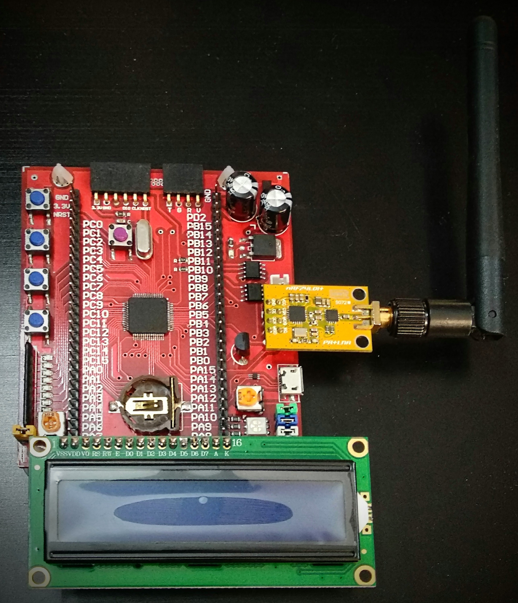
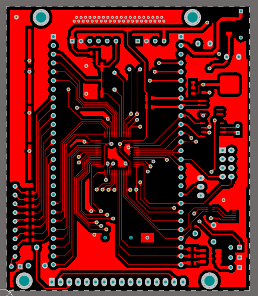
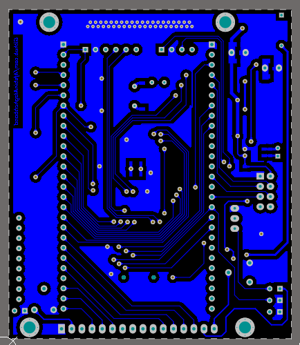
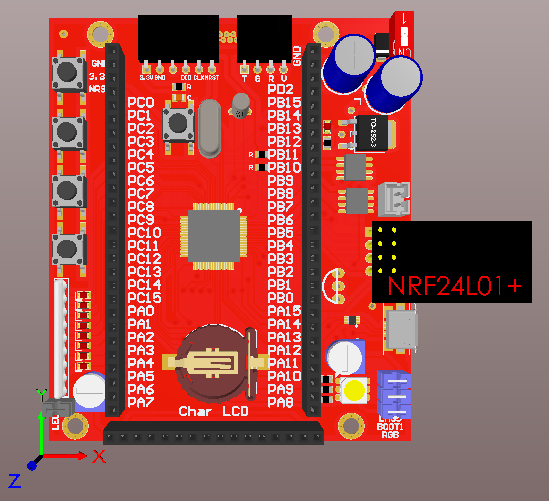

# Educational Board

This board is designed for educational progress. When I started to teach ARM(STM32) programming, designed it for my students. 
I will upload the sample code for this board as soon as possible. 

## Assembled board

## Top Layer

## Bottom Layer

## 3D View

## Board Existing parts

- STM32F103RBT6 microcontroller (if you need more RAM or other peripherals you can change it by STM32F103REt6 or generally STM32-XXXX-R-XXX-)
- Mini ST-Link socket, programming socket (you can find it [HERE](https://github.com/AfshinAlaghehband/PCB-Designe/tree/main/ST-Link%20Mini))
- 8 LEDs and 4 switches (tech GPIO)
- Char LCD (2*16 or 4*20)
- LM35 temperature sensor (tech Analog to digital convertor(ADC))
- USART socket (tech Universal Synchronous Asynchronous Receiver Transmitter)
- AT24C08 EEPROM serial I2C communication (tech i2c protocol)
- NRF24L01+ SPI communication (tech SPI full-duplex protocol)
- MCP2551 can transceiver (tech Controller Area Network) 
- Micro USB
- Battery holder and 11.0592 MHz XTAL Crystal (tech Real Time Clock (RTC))
- RGB LED (tech timers and PWM)

## Repository Existing parts
- Altium PCB project: Schematic, PCB 
- Altium Library contains all components  
- PDF contains Schematic, PCB, and bill of materials 
- STM32 Cube project (.ioc file)

# Bill of Materials 

|Comment|Description|Footprint|
|---|---|-|
 BatteryHolder||Battery Holder CR1220-SMD
470uF|Polar Capacitor|cap 03
100nF|Bipolar Capacitor|SMD_CAP_0805
10UF|Bipolar Capacitor|SMD_CAP_0805
18pF|Bipolar Capacitor|SMD_CAP_1206
Diodes||DO-214AC ( SMD Diode )
header 27||PCBComponent_1
LED RGB|LED 5050 RGB|LED_5050
LCD-CH||LCD2-16
LED|[NoValue], LED Red|LED0805
Screw|Board Screw With Spacer|Board Screw_No Silk
NRF24L01+_Module||NRF24L01+_Module
programming socket|Header, 6-Pin|HDR1X6
jumper|Header, 2-Pin|HDR1X2
MCP2551|CAN TRANSCEIVERS|MCP2551
can Connector||PH Connector 2Pin
330|Resistor|RES 0805 (2012X06L)
ArrayResistor9pin||ArrayRes9
1K|Resistor|RES 0805 (2012X06L)
120|Resistor|RES 0805 (2012X06L)
4.7K|Resistor|RES 0805 (2012X06L)
=partNo|WS-DITV 2.54 mm compact THT with flat actuator|418117170901
Switch PB|Push Button Switch|SW-PB
usart connector||SerialWireMini
LD1117||TO-252-reg
STM32F103RBT6|ARM Cortex-M3 32-bit MCU|STM-LQFP64_N
AT24C08BN|Serial EEPROM |8S1_N
LM35||LM35
USBLC6-2|Very low capacitance ESD protection;|USBLC6-2
USB OTG||USB_Micro
10K|Variable Resistor|Pot 00
8MHz|XTAL Crystal|XTAL Small
11.0592 MHz|XTAL Crystal|XTAL RTC

## Contributing
Pull requests are welcome. For major changes, please open an issue first to discuss what you would like to change.

## Sorce
[Afshin Alaghehband](https://github.com/AfshinAlaghehband/PCB-Designe)

