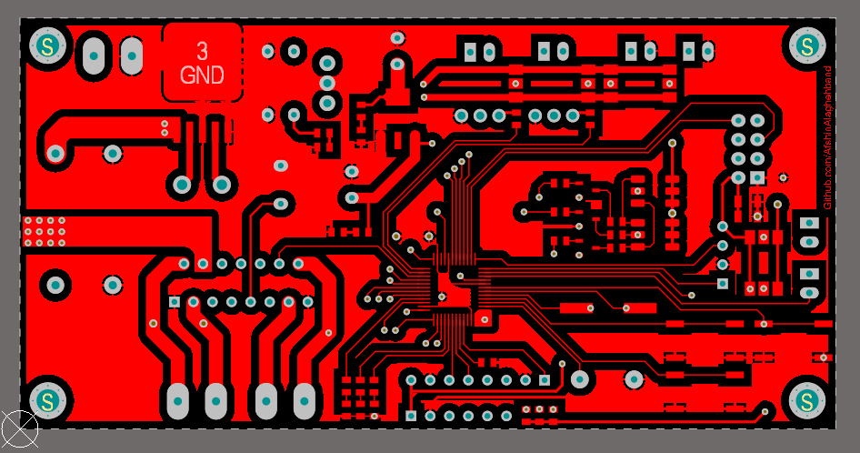
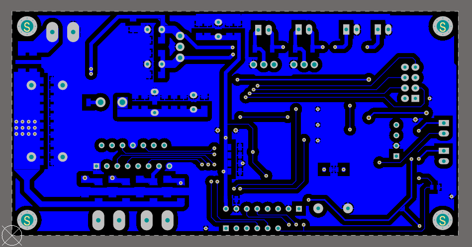

# Ollie Robot

Ollie Robot is a robot which is designed by Sphero. It is a fun project; therefore I decide to make this robot. The following board is its main board contained a dual motor driver (L298n) for driving two motors and a NRF24l0+ for communication. This PCB is based on the STM32F103CBT6 microcontroller. 

## Top Layer

## Bottom Layer

## Existing parts
- Altium PCB project: Schematic, PCB 
- Altium Library contains all components  
- PDF contains Schematic, PCB, and bill of materials 
- STM32 Cube project (.ioc file)

# Bill of Materials 

|Comment|Description|Footprint|
|---|---|-|
 1K | Resistor | RES 0805 (2012X06L) 
 4.7K | Resistor | RES 0805 (2012X06L) 
 8Mhz | XTAL Crystal | Crystal SMD 
 10k | Resistor | RES 0805 (2012X06L) 
 10uF | Bipolar Capacitor | SMD_CAP_1206 
 18pf | Bipolar Capacitor | SMD_CAP_0805 
 100nf | Bipolar Capacitor | SMD_CAP_0805 
 100nF | Bipolar Capacitor | SMD_CAP_1206 
 100uh | Inductor | General 10x12(200m) Inductor 
 330 | Resistor | RES 0805 (2012X06L) 
 470uF | Polar Capacitor | cap 03 
 1000uF | Polar Capacitor | cap 03 
 1000uF | Polar Capacitor | cap 04 
 3300uF | Polar Capacitor | CAP 05 
 BC817 | NPN Bipolar Transistor | SOT23_BEC_N 
 BD139 | BJT | BD139 
 Buzzer |  | Buzzer 
 Connector |  | Polarized Header 2 
 Connector |  | Terminal Block 2pin 
 JumperSMD 3Pin |  | JumperSMD 3Pin 
 L78XX | Linear Regulator | To-220 
 L298n | Motor Driver | Multiwatt15V 
 LED |  | LED0805 
 LED RGB | LED 5050 RGB | LED_5050 
 LM1117IMP-3.3 | 3.3 Volt, 800mA Linear Regulator | MP04A_N 
 LM2576 - 5 | Switching Voltage Regulator | TO-263-5 
 MPU 6050 | Header, 8-Pin | HDR1X8 
 NRF24L01+_Module |  | NRF24L01+_Module 
 ProgrammerSocket | Header, 6-Pin | HDR1X6 
 R2T-MiniSerial |  Header, 4-Pin | SerialWireMini 
 Screw | Board Screw With Spacer | Board Screw 
 SMD Diodes | schottky diode  | DO-214AC ( SMD Diode ) 
 STM32F103CBT6 | ARM Cortex-M3 32-bit MCU | STM-LQFP48_N 
 Switch PB | Push Button Switch | SW-PB 

## Contributing
Pull requests are welcome. For major changes, please open an issue first to discuss what you would like to change.

## Sorce
[Afshin Alaghehband](https://github.com/AfshinAlaghehband/PCB-Designe)

