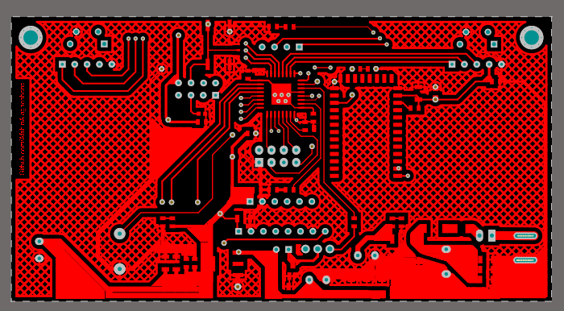
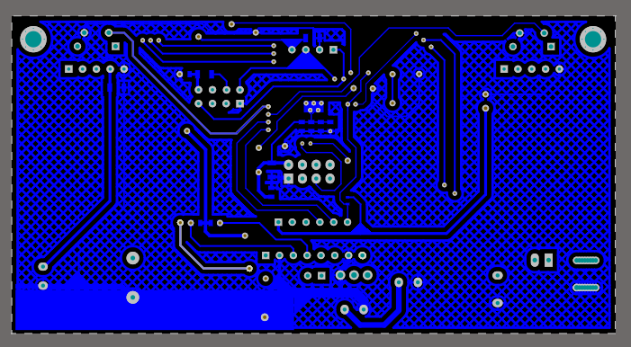
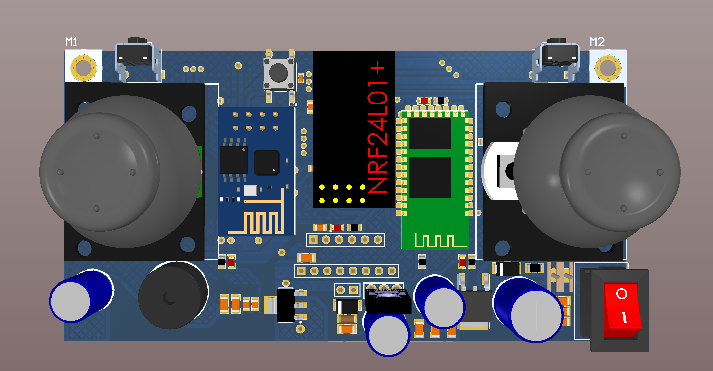

# Ollie Robot

Ollie Robot is a robot which is designed by Sphero. The robot can connect to a smartphone and control by it;
While it is controlled over Bluetooth, I designed a joystick for it. 
This joystick can be used for other projects too.

The board contains the following list.
|properties|
|--|
|Two resistor-based joysticks and two switches for control|
|Bluetooth, NRF24l01+, and wi-fi for communication|
|Shocker motor controller|
|Buzzer|
|Gyroscope mpu6050 connector|
|STM32F030K6T6 microcontroller|
 

## Top Layer

## Bottom Layer

## 3D View

## Existing parts
- Altium PCB project: Schematic, PCB 
- Altium Library contains all components  
- PDF contains Schematic, PCB, and bill of materials 
- STM32 Cube project (.ioc file)

# Bill of Materials 

|Comment|Description|Footprint|
|---|---|----|
 Buzzer |  | Buzzer 
 BD139 | BJT | BD139 
 1000uF | Polar Capacitor | cap 04 
 10UF | Bipolar Capacitor | SMD_CAP_1206 
 100nF | Bipolar Capacitor | SMD_CAP_1206 
 470uF | Polar Capacitor | cap 03 
 10uf | Bipolar Capacitor | SMD_CAP_0805 
 100nf | Bipolar Capacitor | SMD_CAP_0805 
 100nf | Bipolar Capacitor | SMD_CAP_0603 
 100uf | Bipolar Capacitor | SMD_CAP_1206 
 SMD Diodes |  | DO-214AC ( SMD Diode ) 
 5v |  | DIOMELF3615N 
 2A | Resistor | RES 1206 (3216X08L) 
 HC-05 Bluetooth |  | HC-05 
 L78M05 | Precision 500mA Regulator | TO-252 
 ESP8266 ESP-01 | ESP8266 ESP-01 | ESP8266 ESP-01 
 joystick | joystick | joystick 
 LED |  | LED0805 
 Screw | Board Screw With Spacer | Board Screw 
 Header 2 | Header, 2-Pin | HDR1X2 
 NRF24L01+_Module |  | NRF24L01+_Module-LNA+PA 
 Connector |  | Polarized Header 2 
 ProgrammerSocket | Header, 6-Pin | HDR1X6 
 Header 8 | Header, 8-Pin | HDR1X8 
 1K | Resistor | RES 0805 (2012X06L) 
 330 | Resistor | RES 0805 (2012X06L) 
 1K | Resistor | RES 1206 (3216X08L) 
 10K | Resistor | RES 0805 (2012X06L) 
 10k | Resistor | RES 0603 (1608X06L) 
 4.7K | Resistor | RES 0805 (2012X06L) 
 Rocker Switch |  | Rocker Switch mini 
 Switch | switch right angel | 4312560387x6 
 Switch PB | Push Button Switch | SW-PB 
 SmdJumper |  | SMD Jumper 
 R2T-MiniSerial |  | SerialWireMini 
 LM1117IMP-3.3 | 3.3 Volt, 800mA Linear Regulator | MP04A_N 
 STM32F030K6T6 | ARM Cortex-M0  | STM-LQFP32_N 

## Contributing
Pull requests are welcome. For major changes, please open an issue first to discuss what you would like to change.

## Sorce
[Afshin Alaghehband](https://github.com/AfshinAlaghehband/PCB-Designe)

