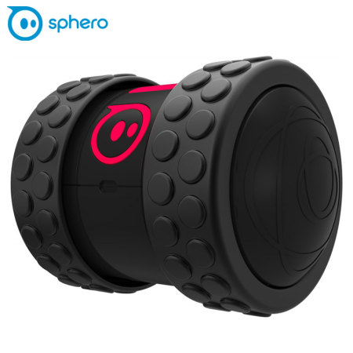

# Ollie Robot

In this project, I design a board to create a robot-like ollie.
I also design a joystick for it can connect to robot by Bluetooth 

## sphero Ollie 

## Existing parts
- Altium PCB project for both mainboard and joystick: Schematic, PCB
- Altium Library contains all components
- PDF contains Schematic, PCB, and bill of materials 
- STM32 Cube project (.ioc file)

## Contributing
Pull requests are welcome. For major changes, please open an issue first to discuss what you would like to change.

## Sorce
[Afshin Alaghehband](https://github.com/AfshinAlaghehband/PCB-Designe)

