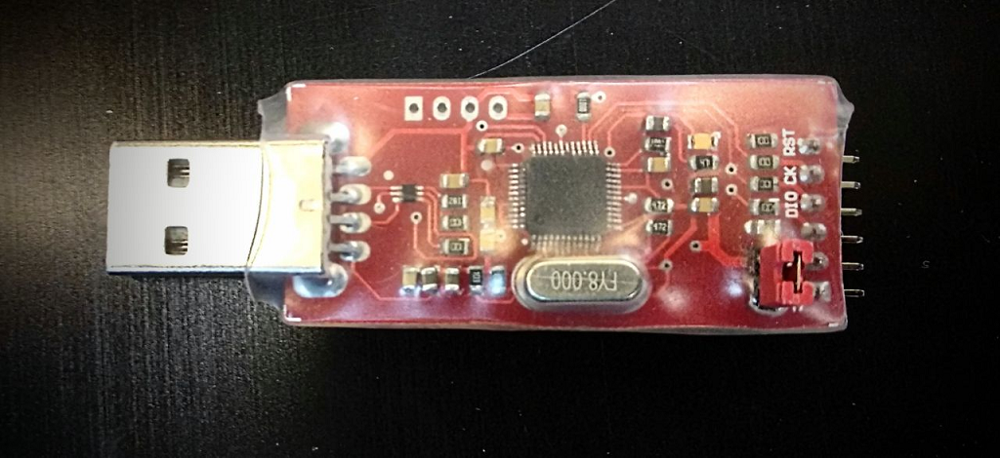
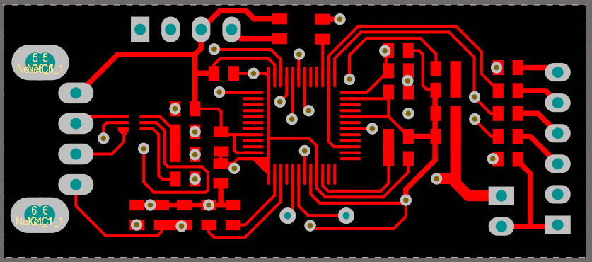
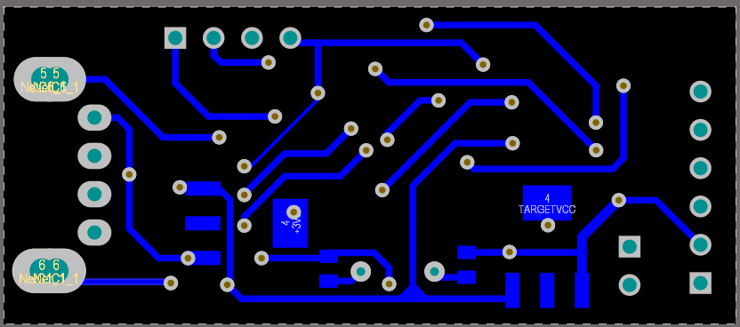
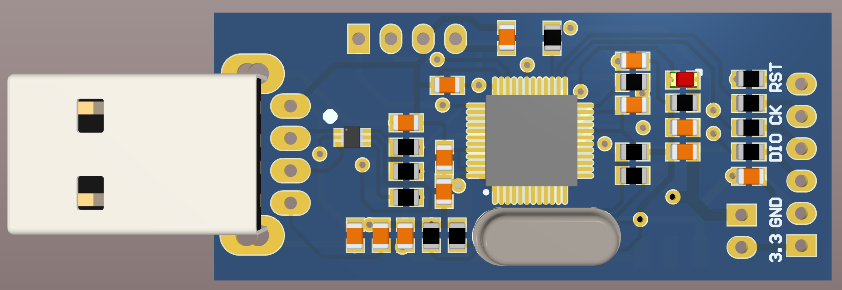

# ST-Link Minin

This board is designed to make a programmer which can programmer all STM32 microcontrollers.

The ST-Link is high price programmer and I had a lot of problems with the ST-Link programmer which is produced in China. Chinese programmer does not have any protection on pins and it causes many problems. I remember me and my friends burned about 20 programmers; therefore we decided to design our Protected programmer. 
This programmer was designed very simple without many costly components; however, it works very good and I did not burn any of this programmer during work even if make a short circuit at the output. 

## Assembled board

## Top Layer

## Bottom Layer

## 3D View

## Repository Existing parts
- Altium PCB project: Schematic, PCB 
- Altium Library contains all components  
- PDF contains Schematic, PCB, and bill of materials 
- ST-Link mini firmware (st-link code)

# Bill of Materials 

|Comment|Description|Footprint|
|---|---|-|
"100nF"|"Bipolar Capacitor"|"SMD_CAP_0805"
"10uf"|"Bipolar Capacitor"|"SMD_CAP_0805"
"20pf"|"Bipolar Capacitor"|"SMD_CAP_0805"
"LED"|"0805"|"LED0805"
"Header 4"|"Header, 4-Pin"|"HDR1X4"
"Header 6"|"Header, 6-Pin"|"HDR1X6"
"Header 2"|"Header, 2-Pin"|"HDR1X2"
"1.5k"|"Resistor"|"RES 0805 (2012X06L)"
"22"|"Resistor"|"RES 0805 (2012X06L)"
"4.7k"|"Resistor"|"RES 0805 (2012X06L)"
"470"|"Resistor"|"RES 0805 (2012X06L)"
"100"|"Resistor"|"RES 0805 (2012X06L)"
"10k"|"Resistor"|"RES 0805 (2012X06L)"
"100k"|"Resistor"|"RES 0805 (2012X06L)"
"LM1117IMP-3.3"|"3.3 Volt, 800mA"|"MP04A_N"
"USBLC6-2"|"Very low capacitance ESD protection;"|"USBLC6-2"
"STM32F103C8T6"|"ARM Cortex-M3 32-bit MCU"|"STM-LQFP48_N"
"Usb-A"|"Connector"|"USB A Connector"
"8MHz"|"XTAL Crystal"|"XTAL Small"

## Contributing
Pull requests are welcome. For major changes, please open an issue first to discuss what you would like to change.

## Sorce
[Afshin Alaghehband](https://github.com/AfshinAlaghehband/PCB-Designe)

